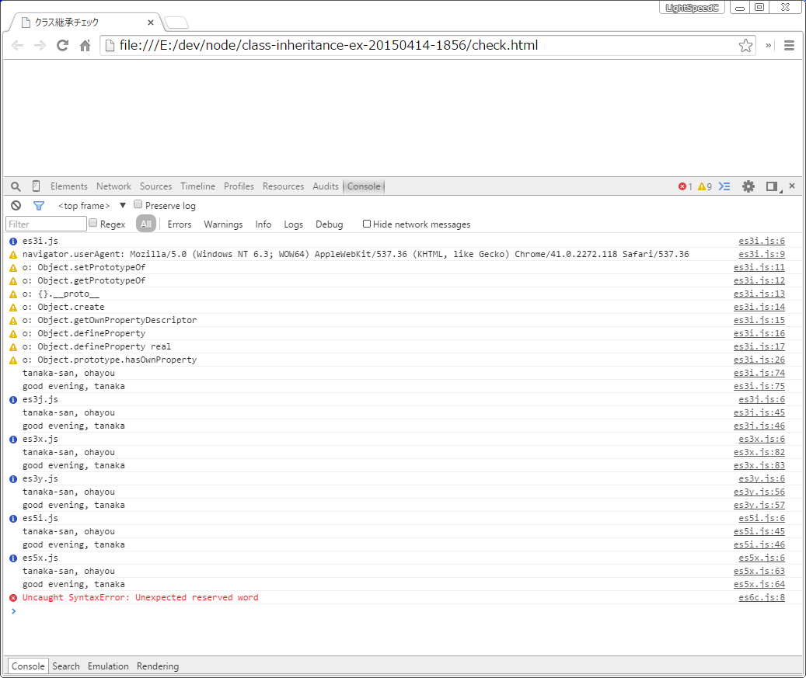
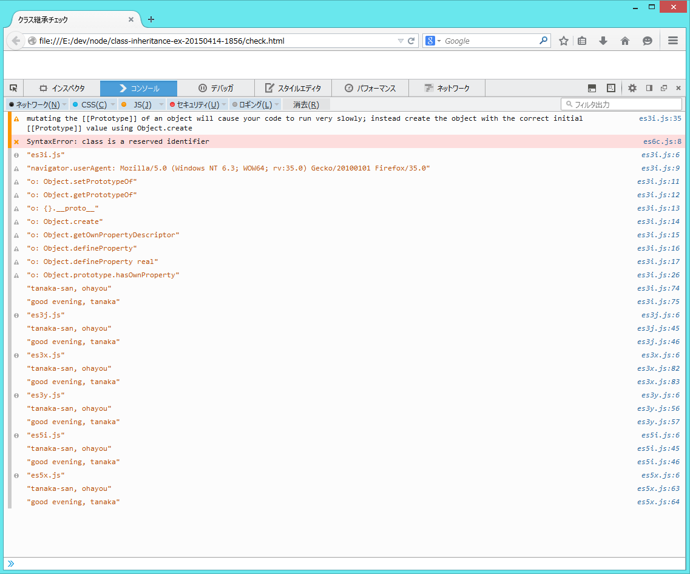
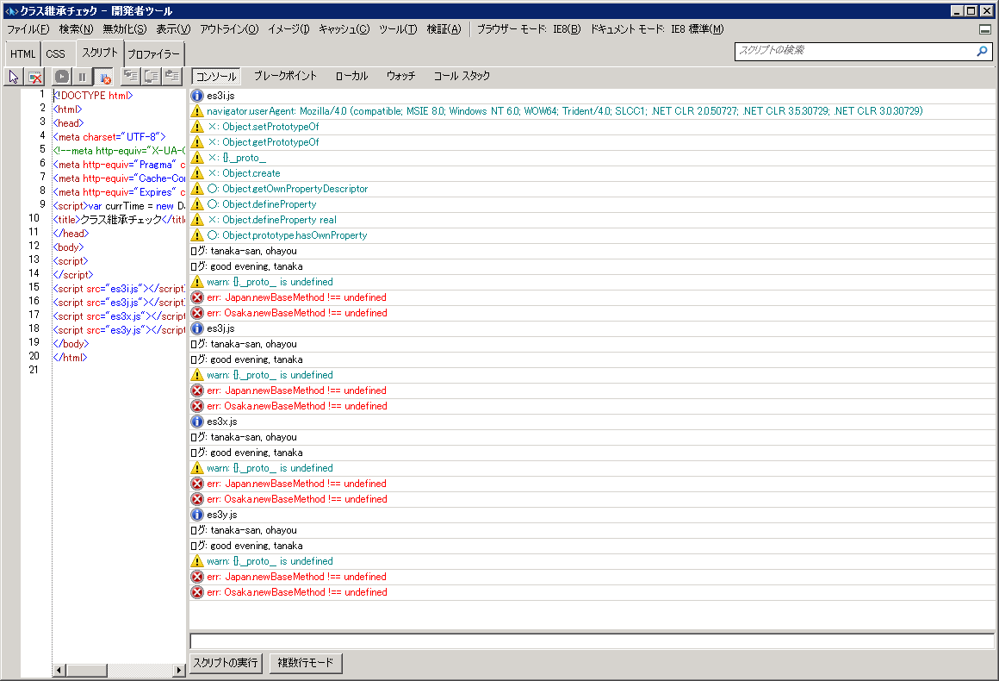

class inheritance example
====

クラス継承のサンプルです。

わかりにくいかもしれませんが画面例をみてもらうと ie8/ie9 では何ができないかがわかると思います。

一応、まともな継承は古いやり方であれば ie8/ie9 もできますね。 
ie8/ie9 でも使いたい場合は ES3 版を見てください。 
新しい Firefox, Chrome, ie11 のみで良ければ ES5 版でもOKです。

+ 昔ながらの es3i (inherits) 新旧対応版
+ 昔ながらの es3j (inherits) 古いやり方のみ
+ クラス風の es3x (extend) 新旧対応版
+ クラス風の es3y (extend) 古いやり方のみ
+ 昔ながらの es5i (inherits) 新ブラウザのみ
+ クラス風の es5x (extend) 新ブラウザのみ
+ 新クラス構文の es6c (class) chrome canary のみ

## chrome

## firefox

## ie8

## ie9

